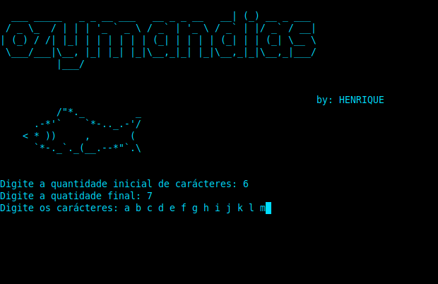

<h1>O Z Y M A N D I A S</h1>

<h2>Um gerador de wordlist feito em python3</h2>

<h3>Como usar:</h3>
<strong>Dentro da pasta, digite: </strong>

 

python3 ozymandias.py (Linux)
 

python ozymandias.py (Windows)

Digite a quantidade mínima de carácteres (ex: 6)

Digite a quantidade máxima (ex: 8)

Digite os carácteres separados por espaço (ex: a b c d e f g...)

Digite um nome para o arquivo gerado contendo a extensão (ex: senhas.txt)

 

<strong>

Nesse caso, o programa irá gerar todas as possibilidades de senhas contendo de 6 a 8 dígitos com os carácteres selecionados

</strong>

